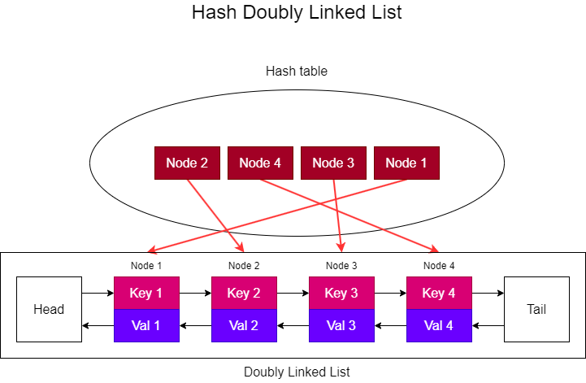

# Problem

### [Problem 146 from LeetCode](https://leetcode.com/problems/lru-cache/description/)

# LRU Cache
Design a class that functions like a [Least Recently Used (LRU) cache](https://en.wikipedia.org/wiki/Cache_replacement_policies#LRU) **which can workn in any programing language**. A LRU is a type of Cache that, when full, discards the element that was utilized the longest time ago. In this problem assume that the cache's capacity is defined in it's initialization and that it should receive a key with its value.

As a cache, it must have `put` and `get` functionality and both must at least have a time complexity of O(1) on average.

* the `get` function should return the `value` of the `key` if it exists, otherwise return `-1`.

* hte `put` function should insert the `key` and its `value` in the cache if it does not exist, otherwise it must update it's value. If the number of keys exceed the `capcity` of the cache, remove the least recently used one.

# Example
```
new LRUCache(2)    // Cache's capacity is 2
lRUCache.put(1, 1) // cache is {1=1}
lRUCache.put(2, 2) // cache is {1=1, 2=2}
lRUCache.get(1)    // return 1
lRUCache.put(3, 3) // LRU key was 2, evicts key 2, cache is {1=1, 3=3}
lRUCache.get(2)    // returns -1 (not found)
lRUCache.put(4, 4) // LRU key was 1, evicts key 1, cache is {4=4, 3=3}
lRUCache.get(1)    // return -1 (not found)
lRUCache.get(3)    // return 3
lRUCache.get(4)    // return 4
```

# Hints
<ol>
<li>Think first of how you would implement this class without the time complexity constraint.</li>
<li>What are the features that are needed to acheive the O(1) time complexity this problem? Which of them are lacking from the unconstrained solution?</li>
<li>Is there a combination of data structures that can fufill all the feature requirements?</li>
</ol>

# Solution
The feature we need to have to acheive the desired time complexity are: 
* `Fast to search` : we need to be able to find if a key exists in the cache.
* `Fast to insert` : We need to insert the data to the head upon each visit.  
* `Fast to delete` : if the cache is full, we need to delete the last element.   
* `ordered` : the data has to be ordered to distinguish recently used and longest unused.

The most attractive data structure for the implementation of the cache is a hash table, which can be fast to search, insert and delete, but they are *unordered* which makes determining the last recently used key impossible without the usage of another datastructure.

Another option is a doubly linked List which is quick for inserting at the beginning or end, has the advantage that it can be ordered and each node "knows" which comes before and after permitting quicker insertions, deletions and moving of nodes outside the edges when compared to a single linked list. Although it has the disadvantage that searching them is still costly, therefore the same is true for inserting and deleting outside the edges.

However, if we combine them into a Hash doubly Linked List then we can get the best of both worlds. If we store the node class as the value of the key in the hash table we are now able to quickly look them up, enabling the quick search, insertion and deletion of nodes in the middle of the list, all the while being able to preserve the order of the most to the least recently used keys. 

A suggestion for the initialization of the linked list is to have two "dummy" nodes that act as the head and the tail of your list, with the actual ordered one being inserted in the middle of them.

The structure should be somewhat similar to this image:

<div style="text-align: center;">



</div>

As stated in the description of the problem, the time complexity for the `put` and `get` functions on average will be O(1), and the space complexity of this problem will be O(n), where n is the size of the capacity of the cache.

PS.: In python there is a simpler solution due to the fact that since version 3.7, dictionaries are already ordered. See if you can figure out how to solve it this way.

Reference:
https://leetcode.com/problems/lru-cache/solutions/4797281/python-3-4-solutions-hash-linked-list-ddl-hashmap-ordereddict-hashmap/